# Manuscripta Android Client - System Design Audit

This document provides a comprehensive system design audit for the Android student client of the Manuscripta platform, based on the complete implementation requirements defined in `issues.md` and related documentation.

---

## Executive Summary

The Manuscripta Android client is a student-facing application designed for e-ink tablet devices. It operates as the **client** in a client-server architecture, communicating with a Windows-based teacher application over LAN using a hybrid multi-channel networking approach (HTTP, TCP, UDP).

**Key Design Principles:**
- **Clean Architecture** with clear separation between Data, Domain, and Presentation layers
- **Offline-first** with local Room database and sync queues
- **E-ink optimised** with monochrome theme and minimal refreshes
- **Heartbeat-triggered content delivery** since Windows server cannot initiate HTTP requests

---

## 1. Data Model Layer (Entity-Relationship Diagram)

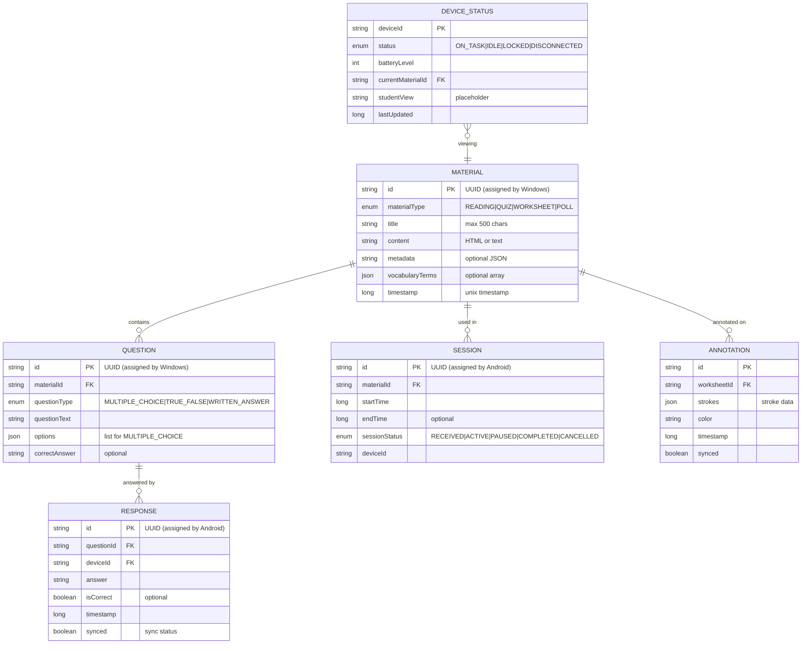

---

## 2. Network Communication Sequence Diagrams

### 2.1 Pairing Process

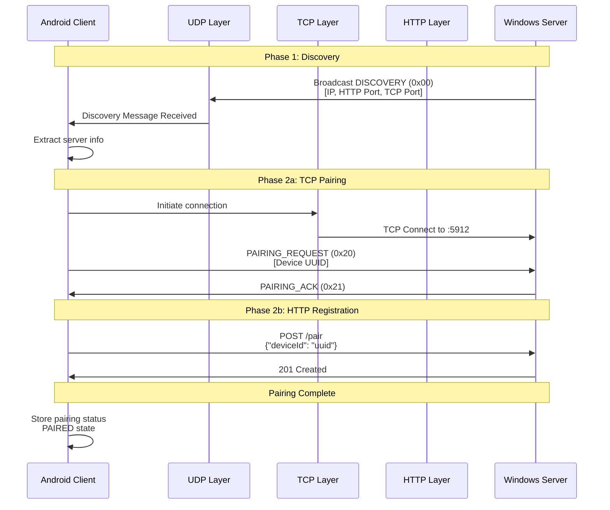

### 2.2 Material Distribution (Heartbeat-Triggered Fetch)

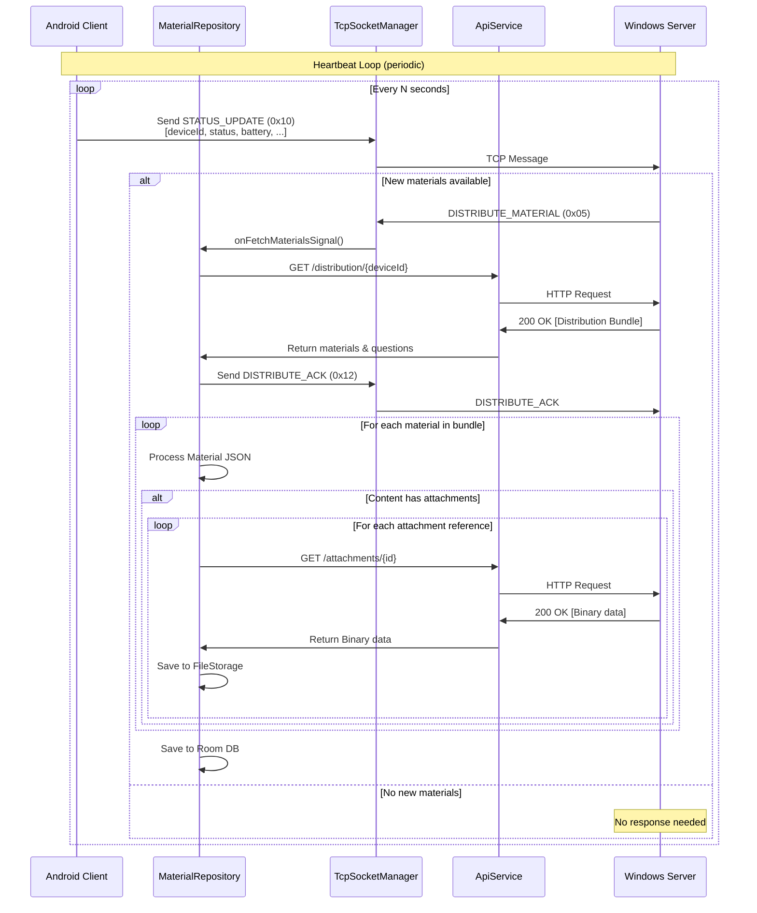

### 2.3 Student Response Submission

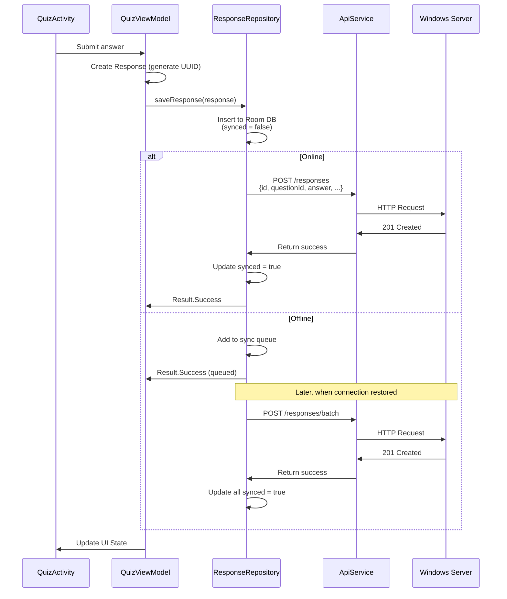

### 2.4 Teacher Control Commands

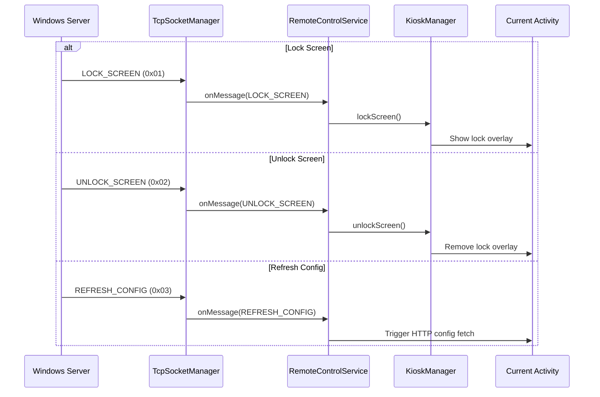

### 2.5 Raise Hand Flow

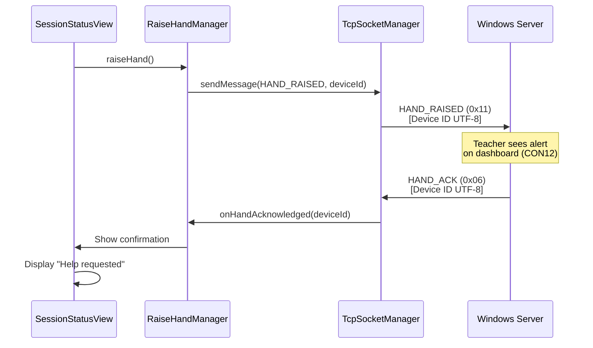

---

## 3. State Machine Diagrams

### 3.1 Pairing State Machine

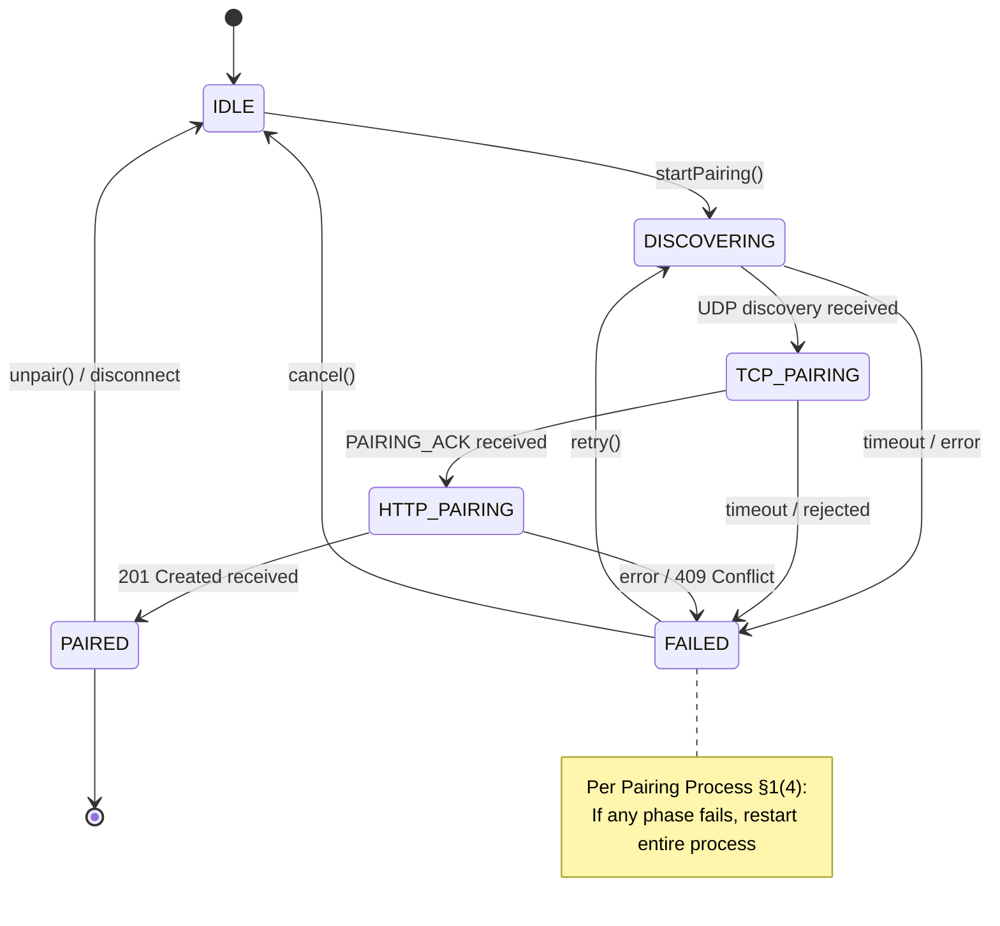

### 3.2 Session State Machine

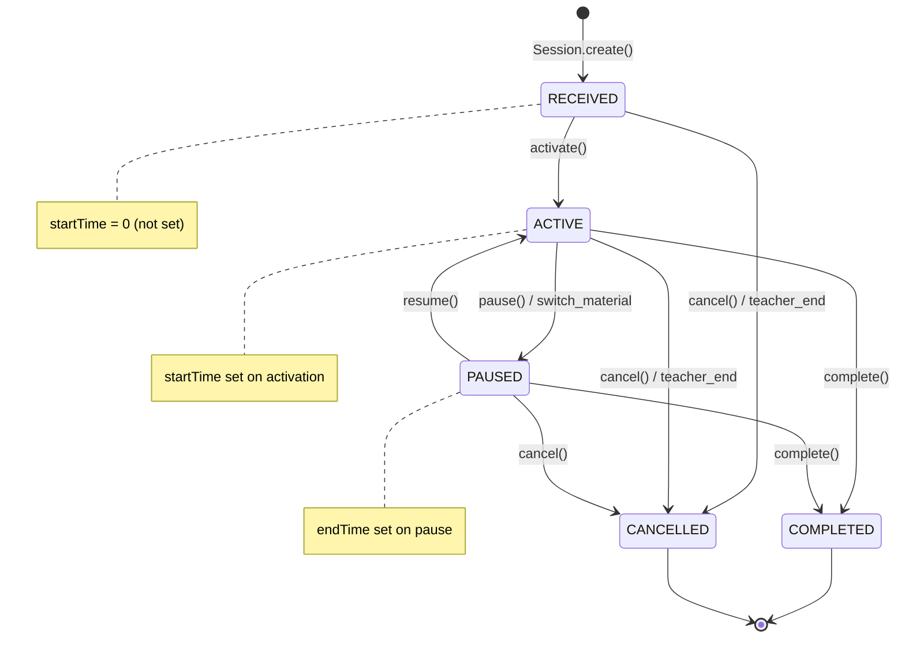

### 3.3 Device Status State Machine

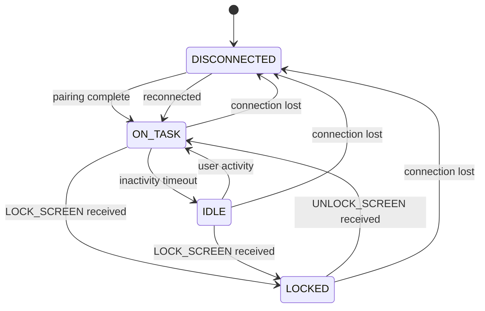

---

## 4. Class Diagram (Core Components)

```mermaid
classDiagram
    direction TB
    
    %% Domain Models
    class Material {
        +String id
        +MaterialType type
        +String title
        +String content
        +String metadata
        +List~VocabularyTerm~ vocabularyTerms
        +long timestamp
    }
    
    class Question {
        +String id
        +String materialId
        +QuestionType questionType
        +String questionText
        +List~String~ options
        +String correctAnswer
    }
    
    class Response {
        +String id
        +String questionId
        +String deviceId
        +String answer
        +Boolean isCorrect
        +long timestamp
        +static create(questionId, answer) Response
    }
    
    class Session {
        +String id
        +String materialId
        +long startTime
        +long endTime
        +SessionStatus status
        +String deviceId
        +static create(materialId, deviceId) Session
    }
    
    %% Enums
    class MaterialType {
        <<enumeration>>
        READING
        QUIZ
        WORKSHEET
        POLL
    }
    
    class QuestionType {
        <<enumeration>>
        MULTIPLE_CHOICE
        TRUE_FALSE
        WRITTEN_ANSWER
    }
    
    class SessionStatus {
        <<enumeration>>
        ACTIVE
        PAUSED
        COMPLETED
        CANCELLED
    }
    
    class DeviceStatus {
        <<enumeration>>
        ON_TASK
        IDLE
        LOCKED
        DISCONNECTED
    }
    
    %% Repositories
    class MaterialRepository {
        <<interface>>
        +getMaterials() Flow~List~Material~~
        +getMaterialById(id) Flow~Material~
        +syncMaterials() Result~Unit~
        +onFetchMaterialsSignal()
    }
    
    class ResponseRepository {
        <<interface>>
        +submitResponse(response) Result~Unit~
        +submitBatch(responses) Result~Unit~
        +getUnsyncedResponses() List~Response~
    }
    
    class SessionRepository {
        <<interface>>
        +startSession(materialId, deviceId) Session
        +getActiveSession() Session?
        +updateSession(session)
        +endSession(sessionId)
    }
    
    %% Network
    class TcpSocketManager {
        +connect(ip, port)
        +disconnect()
        +sendMessage(opcode, operand)
        +addMessageListener(listener)
        +removeMessageListener(listener)
        +isConnected() boolean
    }
    
    class UdpDiscoveryManager {
        +startDiscovery()
        +stopDiscovery()
        +getDiscoveryState() StateFlow~DiscoveryState~
    }
    
    class PairingManager {
        +startPairing()
        +cancelPairing()
        +getPairingState() StateFlow~PairingState~
        +getDeviceId() String
        +isPaired() boolean
    }
    
    class ApiService {
        <<interface>>
        +getMaterials() Call~List~String~~
        +getMaterialById(id) Call~MaterialDto~
        +getAttachment(id) Call~ResponseBody~
        +getConfig() Call~ConfigDto~
        +submitResponse(dto) Call~Unit~
        +submitBatchResponses(dto) Call~Unit~
        +registerDevice(dto) Call~Unit~
    }
    
    %% Relationships
    Material --> MaterialType
    Question --> QuestionType
    Session --> SessionStatus
    
    Material "1" --> "*" Question
    Question "1" --> "*" Response
    Material "1" --> "*" Session
    
    MaterialRepository --> ApiService
    MaterialRepository --> TcpSocketManager
    ResponseRepository --> ApiService
    
    PairingManager --> UdpDiscoveryManager
    PairingManager --> TcpSocketManager
    PairingManager --> ApiService
```

---

## 5. Dependency Injection Structure

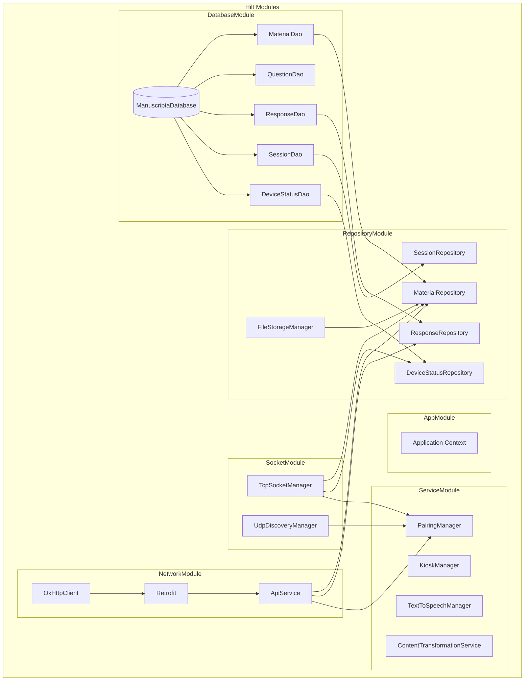

---

## 6. Binary Protocol Reference

### 6.1 Opcode Registry

| Range | Purpose | Direction |
|-------|---------|-----------|
| `0x00` | UDP Discovery | Server → Client |
| `0x01` - `0x0F` | Control Commands | Server → Client (TCP) |
| `0x10` - `0x1F` | Status Updates | Client → Server (TCP) |
| `0x20` - `0x2F` | Pairing | Bidirectional (TCP) |

### 6.2 Message Definitions

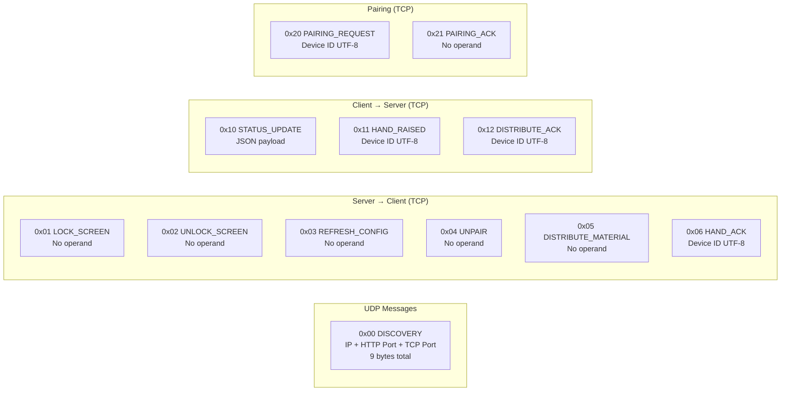

---

## 7. Key Design Decisions

### 7.1 Entity ID Generation Policy

| Entity | ID Generator | Rationale |
|--------|--------------|-----------|
| Material | Windows Server | Content created by teacher |
| Question | Windows Server | Part of material content |
| Response | Android Client | Student interaction |
| Session | Android Client | Device-local session |
| DeviceId | Android Client | Device identification |

> [!IMPORTANT]
> Per Validation Rules §3: IDs must be UUIDs generated by the creating client and treated as immutable by the receiving client.

### 7.2 Heartbeat-Triggered Fetch Pattern

The Windows server cannot initiate HTTP requests to Android clients. Material distribution uses:

1. **Android** sends periodic `STATUS_UPDATE` (0x10) via TCP
2. **Windows** responds with `DISTRIBUTE_MATERIAL` (0x05) if content pending
3. **Android** initiates HTTP `GET /distribution/{deviceId}` to download

### 7.3 Clean Architecture Entity Separation

- **Entities** (`*Entity.java`): Room annotations, persistence only
- **Domain Models** (`*.java`): Business logic, factory methods for ID/timestamp generation
- **DTOs** (`*Dto.java`): Network serialization, JSON annotations

---

## 8. Screen Flow Diagram

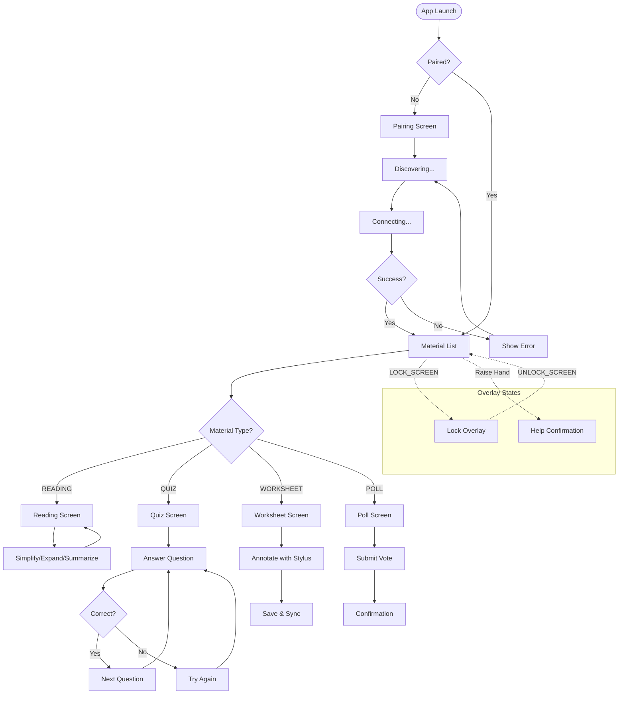

---

## 9. Requirements Traceability Matrix

| Requirement | Component | Issue(s) |
|-------------|-----------|----------|
| **MAT1** (Display materials) | MaterialListActivity, MaterialRepository | 1.1, 2.1, 4.1 |
| **MAT2B** (Feedback display) | FeedbackDialog, QuizViewModel | 4.2, 4.6 |
| **MAT3** (Try Again) | QuizActivity | 4.2 |
| **MAT4** (Simplify/Expand/Summarize) | ContentTransformationService | 5.2, 5.3, 5.4 |
| **MAT5** (AI assistance) | Future/Out of scope | - |
| **MAT6** (Key Vocabulary) | VocabularyDisplayView | 11.1 |
| **MAT7** (Raise Hand) | RaiseHandManager, SessionStatusView | 6.4, 4.5 |
| **MAT8** (Handwriting) | AnnotationLayerView | 11.2, 4.3 |
| **ACC1** (Stylus input) | Stylus optimization | 5.5 |
| **ACC3** (Text-to-Speech) | TextToSpeechManager | 5.1 |
| **ACC4** (Monochrome) | themes.xml | 4.8 |
| **NET1** (LAN material distribution) | MaterialRepository, TcpSocketManager | 2.1, 6.8 |
| **NET2** (Response submission) | ResponseRepository, ApiService | 2.2, 3.5 |
| **CON2A** (Device status) | DeviceStatusRepository | 2.4, 6.3 |
| **CON6** (Lock screen) | RemoteControlService, KioskManager | 6.5, 6.1 |
| **CON12** (Help alert) | RaiseHandManager | 6.4 |
| **SYS1** (E-ink compatibility) | E-ink optimizations | 10 |

---

## 10. Technology Stack Summary

| Layer | Technology | Purpose |
|-------|------------|---------|
| **Language** | Java | Primary development language |
| **Database** | Room | Local SQLite persistence |
| **Networking (HTTP)** | Retrofit + OkHttp | REST API communication |
| **Networking (TCP)** | Native Java Sockets | Real-time control signals |
| **Networking (UDP)** | DatagramSocket | Server discovery |
| **DI** | Hilt | Dependency injection |
| **UI** | ViewBinding + XML | View layer |
| **Architecture** | MVVM + Clean Architecture | Separation of concerns |
| **Async** | LiveData / StateFlow | Reactive state management |

---

*Document generated based on: `Project Specification.md`, `API Contract.md`, `Validation Rules.md`, `Pairing Process.md`, and `android/issues.md`*
