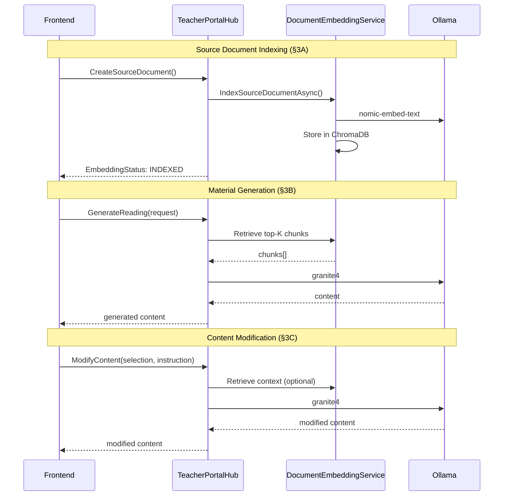

# Generative AI Component Specifications (Windows)

## Explanatory Note

This document defines the specifications for the Windows application's backend generative AI functionalities. It specifies the Retrieval-Augmented Generation (RAG) pipeline for efficient context injection from source documents.

Frontend workflows interacting with these functionalities are defined in FrontendWorkflowSpecifications §4AA, §4B, and §4C.

---

## Section 1 — General Principles

(1) All GenAI functionalities of the Windows application must be provided locally via Ollama.

(2) The following models shall be used, with task-specific assignments:

| Purpose | Model | Ollama Name | Rationale |
|---------|-------|-------------|----------|
| Material generation | Qwen3 8B | `qwen3:8b` | Better instruction adherence for structured output |
| Content modification | IBM Granite 4.0 | `granite4` | Speed for inline edits |
| Feedback generation | IBM Granite 4.0 | `granite4` | Less structured output required |
| Embeddings | Nomic Embed Text | `nomic-embed-text` | Optimised for retrieval |

(3) Ollama is assumed to have been installed silently during the installation of the Windows application.

(4) Before invoking any model, the backend shall —

    (a) verify that the required model is locally available via Ollama, and run `ollama pull <model>` if it is missing.

    (b) verify that Ollama's daemon is running by calling `http://localhost:11434`, and run `ollama serve` if it is not.

(5) Source documents shall not be passed in full to the language model. Instead, the backend shall use semantic retrieval to extract relevant chunks, as specified in Section 2.

(6) If the primary model (`qwen3:8b`) for material generation is unavailable or insufficient resources are detected —

    (a) the backend may fall back to a smaller model (`granite4`).

    (b) if a fallback is used, the iterative refinement process specified in §3F shall be applied.

---

## Section 2 — Document Chunking and Vector Storage

(1) When a source document transcript is chunked, as part of the indexing workflow in §3A(2) —

    (a) the transcript shall be split into chunks of at most 512 tokens.

    (b) adjacent chunks shall overlap by 64 tokens to preserve context continuity.

    (c) chunk boundaries shall respect sentence boundaries where possible.

(2) When a chunk is embedded —

    (a) the backend shall call Ollama's embedding endpoint with `nomic-embed-text`.

    (b) the resulting vector shall have 768 dimensions.

(3) When embeddings are stored —

    (a) ChromaDB shall be used in embedded mode.

    (b) ChromaDB shall store its data in `%AppData%\ManuscriptaTeacherApp\VectorStore`.

    (c) a single collection named `source_documents` shall be used, with metadata including `SourceDocumentId` and `UnitCollectionId`.

(4) When relevant context is retrieved —

    (a) the backend shall embed the query text using `nomic-embed-text`.

    (b) the backend shall query ChromaDB for the top-K most similar chunks, applying the following filters:

        (i) if `SourceDocumentIds` are provided, filter by those specific document IDs.

        (ii) otherwise, filter by `UnitCollectionId` to include all indexed documents in the unit collection.

    (c) the default value of K shall be 5.

---

## Section 3 — Backend GenAI Workflows

(1) Each subsection of this Section shall be implemented as a separate service class:

| Section | Service Class |
|---------|---------------|
| §3A | `DocumentEmbeddingService` |
| §3B | `MaterialGenerationService` |
| §3C | `ContentModificationService` |
| §3D | `FeedbackGenerationService` |
| §3DA | `FeedbackQueueService` |
| §3E | `EmbeddingStatusService` |
| §3F | `OutputValidationService` |

(2) All service classes shall depend on a common `OllamaClientService` for low-level Ollama API interactions (model verification, chat completion, embedding generation).

### Section 3A — Source Document Indexing

(1) When a `SourceDocumentEntity` is created, as specified in FrontendWorkflowSpecifications §4AA, the backend shall index it for semantic retrieval.

(2) The indexing workflow shall proceed as follows —

    (a) set the `EmbeddingStatus` field (AdditionalValidationRules §3A(1)(c)) to `PENDING`.

    (b) split the `Transcript` field into chunks as specified in §2(1).

    (c) for each chunk, generate an embedding as specified in §2(2).

    (d) store the embeddings in ChromaDB as specified in §2(3), associating each chunk with the `SourceDocumentId` and `UnitCollectionId`.

    (e) upon successful completion, update `EmbeddingStatus` to `INDEXED`.

    (f) if any step fails, update `EmbeddingStatus` to `FAILED`.

(3) When a `SourceDocumentEntity` is updated, as specified in FrontendWorkflowSpecifications §4AA —

    (a) remove all existing chunks associated with the document from ChromaDB.

    (b) re-index the document following the workflow in (2).

(4) When a `SourceDocumentEntity` is deleted, as specified in FrontendWorkflowSpecifications §4AA —

    (a) remove all chunks associated with the document from ChromaDB.

(5) The above workflows require the following internal operations —

    (a) `Task IndexSourceDocumentAsync(SourceDocumentEntity document)` — Executes the indexing workflow in (2).

    (b) `Task RemoveSourceDocumentAsync(Guid sourceDocumentId)` — Removes all chunks for the given document from ChromaDB.

(6) Upon indexing failure —

    (a) the backend shall retry automatically up to `MAX_EMBEDDING_RETRIES` (see Appendix A) with exponential backoff (1 second, 10 seconds, 60 seconds).

    (b) if all retries are exhausted, the backend shall —

        (i) set `EmbeddingStatus` to `FAILED`.

        (ii) notify the frontend via the SignalR handler `OnEmbeddingFailed(Guid sourceDocumentId, string error)` (NetworkingAPISpec §2(1)(d)).

    (c) the document shall remain in `FAILED` status until manually retried or deleted.

(7) The frontend may request re-indexing of a failed document by invoking —

    (a) `Task RetryEmbedding(Guid sourceDocumentId)` (NetworkingAPISpec §1(1)(i)(vii))

(8) On application startup, the backend shall —

    (a) identify all `SourceDocumentEntity` objects with `EmbeddingStatus` of `FAILED`.

    (b) not automatically retry these documents (to avoid repeated failures).

    (c) the frontend may offer a batch retry option.

### Section 3B — Material Generation

(1) When a teacher wishes to generate reading or worksheet content using AI, the frontend shall invoke one of the following server methods (NetworkingAPISpec §1(1)(i)) via `TeacherPortalHub` —

    (a) `Task<GenerationResult> GenerateReading(GenerationRequest request)`

    (b) `Task<GenerationResult> GenerateWorksheet(GenerationRequest request)`

(2) `GenerationRequest`, as defined in AdditionalValidationRules §3AB, shall be passed as the parameter to these methods. The response shall be a `GenerationResult` as defined in AdditionalValidationRules §3AC.

(3) Upon receiving a generation request, the backend shall —

    (a) embed the `Description` field using `nomic-embed-text`.

    (b) query ChromaDB for the top-K most similar chunks, applying filters as specified in §2(4)(b).

    (c) construct a prompt containing —

        (i) the retrieved chunks as context.

        (ii) the reading age, actual age, and duration constraints.

        (iii) instructions to generate content in Material Encoding Specification format.

        (iv) for worksheets, instructions to include question references as specified in Material Encoding Specification §4(4).

    (d) invoke `qwen3:8b` via Ollama to generate the content (or `granite4` if fallback per §1(6)).

    (e) validate the generated content and apply refinement as specified in §3F.

    (f) return the `GenerationResult` containing the content and any validation warnings.

### Section 3C — Content Modification (AI Assistant)

(1) When a teacher wishes to modify selected content using the AI assistant, the frontend shall invoke the following server method (NetworkingAPISpec §1(1)(i)(iv)) via `TeacherPortalHub` —

    (a) `Task<GenerationResult> ModifyContent(string selectedContent, string instruction, Guid? unitCollectionId)`

(2) Upon receiving a modification request, the backend shall —

    (a) if `unitCollectionId` is provided, retrieve relevant chunks as specified in §2(4) using the `instruction` as the query.

    (b) construct a prompt containing —

        (i) the selected content.

        (ii) the teacher's instruction.

        (iii) any retrieved context (if applicable).

        (iv) instructions to return modified content in Material Encoding Specification format.

    (c) invoke `granite4` via Ollama to generate the modified content.

    (d) validate the modified content and apply refinement as specified in §3F.

    (e) return the `GenerationResult` containing the content and any validation warnings.

### Section 3D — Feedback Generation

(1) AI feedback generation shall be triggered automatically when a `ResponseEntity` is created for a question that —

    (a) is of type `WRITTEN_ANSWER` (per AdditionalValidationRules §2B(1)(b)); and

    (b) has a `MarkScheme` (per AdditionalValidationRules §2E(1)(a)).

(2) The backend shall maintain an in-memory generation queue.

(3) A response shall be deemed queued for AI feedback generation if —

    (a) its question satisfies the conditions in (1); and

    (b) no `FeedbackEntity` exists for that response; and

    (c) it is present in the generation queue.

(4) A response shall be deemed generating if the `FeedbackGenerationService` is currently processing it.

(5) The frontend may request that a response be added or re-added to the generation queue by invoking —

    (a) `Task QueueForAiGeneration(Guid responseId)` (NetworkingAPISpec §1(1)(i)(vi))

(6) When the teacher creates or saves feedback manually for a response —

    (a) that response shall be removed from the generation queue, if present.

(7) Upon failure of AI feedback generation —

    (a) the response shall be removed from the generation queue.

    (b) the backend shall notify the frontend immediately via the SignalR handler `OnFeedbackGenerationFailed(Guid responseId, string error)`.

    (c) the teacher may retry by invoking `QueueForAiGeneration`.

(8) Upon successful AI feedback generation —

    (a) a `FeedbackEntity` shall be created with status `PROVISIONAL` (AdditionalValidationRules §3AE).

(9) The generation workflow shall —

    (a) retrieve the `QuestionEntity` and `ResponseEntity` for the given IDs.

    (b) construct a prompt containing —

        (i) the question text.

        (ii) the mark scheme.

        (iii) the maximum score, if present.

        (iv) the student's response text.

    (c) invoke `granite4` via Ollama to generate feedback.

    (d) return structured feedback including score justification and improvement suggestions.

### Section 3DA — Feedback Approval Workflow

(1) A `FeedbackEntity` with status `PROVISIONAL` shall not be dispatched to the student device.

(2) Upon teacher approval of feedback —

    (a) the status shall transition from `PROVISIONAL` to `READY`.

    (b) the backend shall trigger dispatch immediately via the mechanism specified in Session Interaction Specification §7.

(3) Upon receipt of a `FEEDBACK_ACK` message from the student device (per Session Interaction Specification §7(4)) —

    (a) the status shall transition from `READY` to `DELIVERED`.

(4) If the backend does not receive a `FEEDBACK_ACK` message within 30 seconds of sending `RETURN_FEEDBACK` (per Session Interaction Specification §7(5)) —

    (a) the backend shall notify the frontend via the SignalR handler `OnFeedbackDispatchFailed(Guid feedbackId, Guid deviceId)`.

    (b) the `FeedbackEntity` shall remain in `READY` status.

    (c) the teacher may retry dispatch by invoking `RetryFeedbackDispatch(Guid feedbackId)` (NetworkingAPISpec §1(1)(h)(iii)).

### Section 3E — Embedding Status Query

(1) When the frontend wishes to display the indexing status of a source document, it shall invoke the following server method (NetworkingAPISpec §1(1)(i)(v)) via `TeacherPortalHub` —

    (a) `Task<EmbeddingStatus> GetEmbeddingStatus(Guid sourceDocumentId)`

(2) The backend shall return the current `EmbeddingStatus` (AdditionalValidationRules §3A(1)(c)) of the specified `SourceDocumentEntity`.

### Section 3F — Output Validation Service

(1) After any content generation step in §3B or §3C, the backend shall validate the output against the Material Encoding Specification.

(2) The validation process shall check for:

    (a) well-formed markdown syntax (headers, lists, code blocks, tables).

    (b) valid custom marker syntax (per Material Encoding Specification §4).

    (c) valid attachment references (per Material Encoding Specification §3).

    (d) valid question references (per Material Encoding Specification §4(4)).

(3) If validation fails and the generation used `qwen3:8b` —

    (a) the backend shall apply deterministic post-processing fixes for common errors, as specified in (5).

    (b) the backend shall re-validate after post-processing.

    (c) if validation still fails, the backend shall return the content with a list of validation warnings.

(4) If validation fails and the generation used `granite4` (fallback mode per §1(6)) —

    (a) the backend shall construct a refinement prompt containing:

        (i) the original output.

        (ii) a list of specific validation errors.

        (iii) instructions to fix only the errors while preserving content.

    (b) the backend shall re-invoke the model with the refinement prompt.

    (c) steps (a) and (b) shall repeat up to a maximum of `MAX_REFINEMENT_ITERATIONS` (see Appendix A).

    (d) after the final iteration, the backend shall apply deterministic post-processing fixes.

    (e) the backend shall return the content with any remaining validation warnings.

(5) Deterministic post-processing fixes shall include:

    (a) closing unclosed code blocks (detecting by counting backtick sequences).

    (b) normalising header levels to a maximum of H3.

    (c) reconstructing malformed question markers where the `id` attribute is parseable.

    (d) reconstructing malformed attachment markers where the `id` attribute is parseable.

    (e) removing invalid or empty custom markers. A custom marker is considered invalid if:

        (i) in the case of an attachment marker, the attachment entity or attachment file associated with the referenced ID does not exist; or

        (ii) in the case of a question marker, the question entity associated with the referenced ID does not exist.

### Section 3G — Validation Warning Response

(1) When the backend returns content with validation warnings —

    (a) the response shall include a `Warnings` field containing a list of unresolved issues.

    (b) each warning shall be a `ValidationWarning` (AdditionalValidationRules §3AD) specifying:

        (i) the line number (if applicable).

        (ii) the error type (e.g., `MALFORMED_MARKER`, `UNCLOSED_BLOCK`, `INVALID_REFERENCE`).

        (iii) a human-readable description.

(2) The frontend shall display warnings to the user, allowing them to manually correct issues in the editor modal.

---

## Appendix A — Configuration Constants

| Constant | Value | Description |
|----------|-------|-------------|
| `CHUNK_SIZE_TOKENS` | 512 | Maximum tokens per chunk |
| `CHUNK_OVERLAP_TOKENS` | 64 | Overlap between adjacent chunks |
| `DEFAULT_TOP_K` | 5 | Default number of chunks to retrieve |
| `EMBEDDING_DIMENSIONS` | 768 | Dimension of `nomic-embed-text` vectors |
| `OLLAMA_BASE_URL` | `http://localhost:11434` | Ollama API endpoint |
| `MAX_EMBEDDING_RETRIES` | 3 | Maximum automatic retry attempts for indexing |
| `MAX_REFINEMENT_ITERATIONS` | 3 | Maximum attempts for iterative refinement |
| `PRIMARY_GENERATION_MODEL` | `qwen3:8b` | Primary model for material generation |
| `FALLBACK_GENERATION_MODEL` | `granite4` | Fallback model if primary unavailable |
| `QUICK_EDIT_MODEL` | `granite4` | Model for AI assistant edits |
| `FEEDBACK_MODEL` | `granite4` | Model for feedback generation |

---

## Appendix B — Workflow Diagram (Illustrative)

The following diagram provides an illustrative overview of the workflows defined in Section 3. In the event of any inconsistency between this diagram and Section 3, Section 3 shall prevail.

