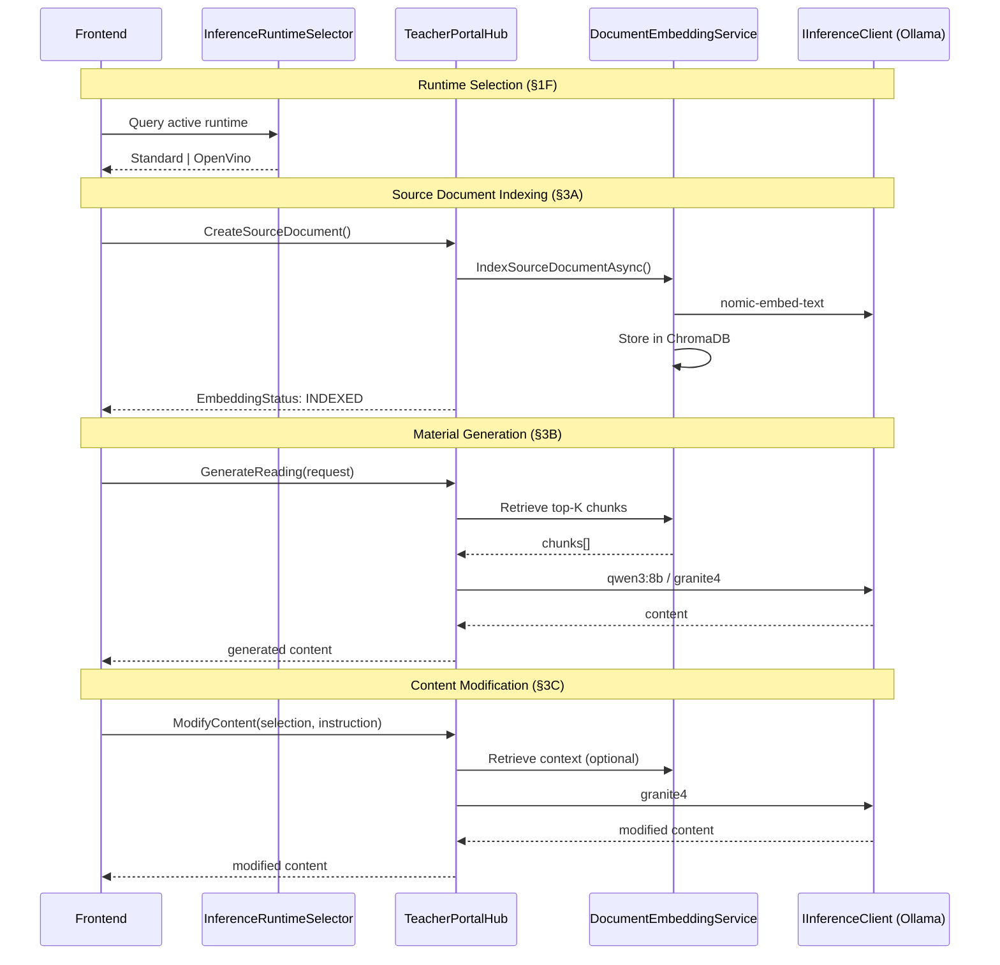

# Generative AI Component Specifications (Windows)

## Explanatory Note

This document defines the specifications for the Windows application's backend generative AI functionalities. It specifies the Retrieval-Augmented Generation (RAG) pipeline for efficient context injection from source documents.

Frontend workflows interacting with these functionalities are defined in FrontendWorkflowSpecifications §4AA, §4B, and §4C.


## Section 1 — General Principles

(1) All GenAI functionalities of the Windows application must be provided locally via an Ollama-compatible inference server. The application shall support two Ollama variants —

    (a) the standard Ollama release ("Standard Ollama"), which uses GGUF-format models; and

    (b) an OpenVINO-accelerated Ollama build ("OV-Ollama"), which uses OpenVINO Intermediate Representation (IR) format models and may leverage Intel NPU, iGPU, or optimised CPU inference paths.

(1A) In this specification, "the active Ollama instance" means whichever variant is currently installed and running pursuant to §1F.

(2) The following models shall be used, with task-specific assignments:

| Purpose | Model | Ollama Name | Standard Format | OV-Ollama Format | Rationale |
|---------|-------|-------------|-----------------|-------------------|----------|
| Material generation | Qwen3 8B | `qwen3:8b` | GGUF | IR (INT4) | Better instruction adherence for structured output |
| Content modification | IBM Granite 4.0 | `granite4` | GGUF | IR (INT4) | Speed for inline edits |
| Feedback generation | IBM Granite 4.0 | `granite4` | GGUF | IR (INT4) | Less structured output required |
| Embeddings | Nomic Embed Text | `nomic-embed-text` | GGUF | IR (INT4) | Optimised for retrieval |

(3) [Deleted.]

(4) [Deleted.]

(5) Source documents shall not be passed in full to the language model. Instead, the backend shall use semantic retrieval to extract relevant chunks, as specified in Section 2.

(6) If the primary model (`qwen3:8b`) for material generation is unavailable or insufficient resources are detected —

    (a) the backend may fall back to a smaller model (`granite4`).

    (b) if a fallback is used, the iterative refinement process specified in §3F shall be applied.

(7) [Deleted.]

(8) Prior to any operation requiring the active Ollama instance, Chroma or any large language model, the application shall verify that the dependency is available and functional in accordance with the Backend Runtime Dependency Management Specification and Sections 1A to 1F of this document.

(9) As the active Ollama instance, the OpenVINO runtime (where applicable), Chroma, and large language models are treated as runtime dependencies, the application shall not assume on startup that they have already been installed. They must only be installed upon user consent expressed from the frontend.


## Section 1A - Ascertaining the availability of Ollama

(1) The `OllamaRuntimeDependencyManager` class shall manage the availability and installation of Ollama by extending the `RuntimeDependencyManagerBase` abstract class specified in the Backend Runtime Dependency Management Specification §2.

(2) The `OllamaRuntimeDependencyManager` class shall have the unique identifier `"ollama"`.

(3) The `OllamaRuntimeDependencyManager` class shall implement abstract methods as follows.

    (a) `Task<Boolean> CheckDependencyAvailabilityAsync()` shall determine the availability of Ollama by calling `http://localhost:11434/api/version`. It shall return true if the HTTP request succeeds with a 200 status code, and false if the request fails.

    (b) `Task DownloadDependencyAsync()` shall download the standalone Windows release from `https://github.com/ollama/ollama/releases/latest/download/ollama-windows-amd64.zip` and store it as `%AppData%\ManuscriptaTeacherApp\bin\ollama-windows-amd64.zip`. It shall also ensure that the `ManuscriptaTeacherApp` directory is included in the PATH environmental variable.

    (c) `Task VerifyDownloadAsync()` shall verify the downloaded ZIP file by comparing its SHA256 hash output against the published checksum. The checksum shall be retrieved from `https://github.com/ollama/ollama/releases/latest/download/sha256sum.txt`, in which the checksum precedes the file name `./ollama-windows-amd64.zip`.

    (d) `Task PerformInstallDependencyAsync()` shall extract the ZIP file to `%AppData%\ManuscriptaTeacherApp\bin\ollama\`, delete the ZIP file and start `ollama serve` from the extracted directory.

    (e) `Task<Boolean> UninstallDependencyAsync()` shall kill any running `ollama.exe` processes, delete the `%AppData%\ManuscriptaTeacherApp\bin\ollama\` directory and return `true` on success.

    (f) `ProvideDependencyServiceAsync()` shall return a singleton instance of `OllamaClientService`.


(4) Before invoking any model, the backend shall —

    (a) verify that Ollama's daemon is running by calling `http://localhost:11434`, and run `ollama serve` if it is not.


## Section 1B - Ascertaining the availability of Chroma

(1) The `ChromaRuntimeDependencyManager` class shall manage the availability and installation of Chroma by extending the `RuntimeDependencyManagerBase` abstract class specified in the Backend Runtime Dependency Management Specification §2.

(2) The `ChromaRuntimeDependencyManager` class shall have the unique identifier `"chroma"`.

(3) The `ChromaRuntimeDependencyManager` class shall implement abstract methods as follows.

    (a) `Task<Boolean> CheckDependencyAvailabilityAsync()` shall determine the availability of Chroma by calling `chroma --version`.

    (b) `Task DownloadDependencyAsync()` shall install Chroma globally by calling `iex ((New-Object System.Net.WebClient).DownloadString('https://raw.githubusercontent.com/chroma-core/chroma/main/rust/cli/install/install.ps1'))`. The location of the installed executable shall also be added to the PATH environment variable.

    (c) `Task VerifyDownloadAsync()` shall be implemented as a no-op. This is because Chroma has not published any checksums or other methods for verifying downloads.

    (d) `Task PerformInstallDependencyAsync()` shall configure ChromaDB to use the data directory `%AppData%\ManuscriptaTeacherApp\VectorStore` and start the ChromaDB server in client-server mode as a background process

    (e) `Task<Boolean> UninstallDependencyAsync()` shall stop the ChromaDB server process if running and return true upon successful termination.

    (f) `ProvideDependencyServiceAsync()` shall return a singleton instance of `ChromaClientService`.


## Section 1C - Ascertaining the availability of Qwen3 8B Model

(1) The `Qwen3ModelRuntimeDependencyManager` class shall manage the availability and installation of the Qwen3 8B model by extending the `RuntimeDependencyManagerBase` abstract class specified in the Backend Runtime Dependency Management Specification §2.

(2) The `Qwen3ModelRuntimeDependencyManager` class shall have the unique identifier `"qwen3:8b"`.

(3) The `Qwen3ModelRuntimeDependencyManager` class shall implement abstract methods as follows.

    (a) `Task<Boolean> CheckDependencyAvailabilityAsync()` shall determine the availability of the Qwen3 8B model by querying Ollama's API endpoint `http://localhost:11434/api/tags` and checking if the response contains a model with name `qwen3:8b`. It shall return `true` if the model is present, and `false` otherwise.

    (b) `Task DownloadDependencyAsync()` shall download the Qwen3 8B model by calling `ollama pull qwen3:8b` via the command line. This operation may take significant time and download several gigabytes of data.

    (c) `Task VerifyDownloadAsync()` shall be implemented as a no-op. This is because Ollama verifies model integrity internally during the pull process.

    (d) `Task PerformInstallDependencyAsync()` shall call `CheckDependencyAvailabilityAsync()` to verify the model is available after `DownloadDependencyAsync()` has completed. If the model is not available, it shall throw an exception.

    (e) `Task<Boolean> UninstallDependencyAsync()` shall remove the Qwen3 8B model by calling `ollama rm qwen3:8b` and return `true` on success.

    (f) `ProvideDependencyServiceAsync()` shall return a singleton instance of `OllamaClientService` configured for the Qwen3 8B model.


## Section 1D - Ascertaining the availability of IBM Granite 4.0 Model

(1) The `GraniteModelRuntimeDependencyManager` class shall manage the availability and installation of the IBM Granite 4.0 model by extending the `RuntimeDependencyManagerBase` abstract class specified in the Backend Runtime Dependency Management Specification §2.

(2) The `GraniteModelRuntimeDependencyManager` class shall have the unique identifier `"granite4"`.

(3) The `GraniteModelRuntimeDependencyManager` class shall implement abstract methods as follows.

    (a) `Task<Boolean> CheckDependencyAvailabilityAsync()` shall determine the availability of the IBM Granite 4.0 model by querying Ollama's API endpoint `http://localhost:11434/api/tags` and checking if the response contains a model with name `granite4`. It shall return `true` if the model is present, and `false` otherwise.

    (b) `Task DownloadDependencyAsync()` shall download the IBM Granite 4.0 model by calling `ollama pull granite4` via the command line. This operation may take significant time and download several gigabytes of data.

    (c) `Task VerifyDownloadAsync()` shall be implemented as a no-op. This is because Ollama verifies model integrity internally during the pull process.

    (d) `Task PerformInstallDependencyAsync()` shall call `CheckDependencyAvailabilityAsync()` to verify the model is available after `DownloadDependencyAsync()` has completed. If the model is not available, it shall throw an exception.

    (e) `Task<Boolean> UninstallDependencyAsync()` shall remove the IBM Granite 4.0 model by calling `ollama rm granite4` and return `true` on success.

    (f) `ProvideDependencyServiceAsync()` shall return a singleton instance of `OllamaClientService` configured for the IBM Granite 4.0 model.


## Section 1E - Ascertaining the availability of Nomic Embed Text Model

(1) The `NomicEmbedTextModelRuntimeDependencyManager` class shall manage the availability and installation of the Nomic Embed Text model by extending the `RuntimeDependencyManagerBase` abstract class specified in the Backend Runtime Dependency Management Specification §2.

(2) The `NomicEmbedTextModelRuntimeDependencyManager` class shall have the unique identifier `"nomic-embed-text"`.

(3) The `NomicEmbedTextModelRuntimeDependencyManager` class shall implement abstract methods as follows.

    (a) `Task<Boolean> CheckDependencyAvailabilityAsync()` shall determine the availability of the Nomic Embed Text model by querying Ollama's API endpoint `http://localhost:11434/api/tags` and checking if the response contains a model with name `nomic-embed-text`. It shall return `true` if the model is present, and `false` otherwise.

    (b) `Task DownloadDependencyAsync()` shall download the Nomic Embed Text model by calling `ollama pull nomic-embed-text` via the command line. This operation may take significant time and download data.

    (c) `Task VerifyDownloadAsync()` shall be implemented as a no-op. This is because Ollama verifies model integrity internally during the pull process.

    (d) `Task PerformInstallDependencyAsync()` shall call `CheckDependencyAvailabilityAsync()` to verify the model is available after `DownloadDependencyAsync()` has completed. If the model is not available, it shall throw an exception.

    (e) `Task<Boolean> UninstallDependencyAsync()` shall remove the Nomic Embed Text model by calling `ollama rm nomic-embed-text` and return `true` on success.

    (f) `ProvideDependencyServiceAsync()` shall return a singleton instance of `OllamaClientService` configured for the Nomic Embed Text model.


## Section 1F — Inference Runtime Selection

(1) The application shall support two inference runtimes — Standard Ollama and OV-Ollama — as defined in §1(1)(a) and §1(1)(b) respectively. Only one runtime shall be active at any given time.

(2) On first launch, and whenever inference runtime dependencies are installed, the application shall determine the preferred runtime as follows —

    (a) the backend shall detect whether an Intel NPU is present by querying the Windows Management Instrumentation (WMI) class `Win32_PnPEntity` for devices whose `Name` property contains "Intel" and "NPU", or by checking for the presence of the `intel_npu` driver;

    (b) if an Intel NPU is detected, the application shall prefer OV-Ollama;

    (c) if no Intel NPU is detected, the application shall use Standard Ollama;

    (d) the user may override the preferred runtime via the Settings interface (FrontendWorkflowSpecifications §7(2A)). The override shall be persisted as an `InferencePreferenceEntity` (AdditionalValidationRules §3F) and shall take effect on the next application startup or when `SwitchInferenceRuntime` (NetworkingAPISpec §1(1)(nz)(iv)) is invoked.

(3) When OV-Ollama is the active runtime, the OpenVINO runtime libraries shall be required as a dependency. The management of this dependency is specified in §1G.

(4) When OV-Ollama is the active runtime, model-specific dependency managers (§1C–§1E) shall source models in IR format as specified in §1H, rather than pulling GGUF models via `ollama pull`.

(5) If the active runtime fails its availability check (`CheckDependencyAvailabilityAsync()`) —

    (a) the application shall attempt to fall back to the other runtime, provided it is installed;

    (b) if neither runtime is available, the application shall notify the frontend in accordance with the Backend Runtime Dependency Management Specification Section 3(2).

(6) A class `InferenceRuntimeSelector` shall be provided as a singleton to —

    (a) determine the active runtime on startup pursuant to Subsection (2);

    (b) expose a property `ActiveRuntime` of an enumeration type `InferenceRuntime` with values `Standard` and `OpenVino`;

    (c) expose a method `Task<Boolean> TrySwitchRuntimeAsync(InferenceRuntime target)` that, subject to dependency availability, switches the active runtime, persists the preference as an `InferencePreferenceEntity` as defined in Additional Validation Rules Section 3F, and restarts the Ollama daemon accordingly.


## Section 1G — Ascertaining the Availability of OV-Ollama

(1) The `OpenVinoOllamaRuntimeDependencyManager` class shall manage the availability and installation of the OpenVINO-accelerated Ollama build by extending the `RuntimeDependencyManagerBase` abstract class specified in the Backend Runtime Dependency Management Specification §2.

(2) The `OpenVinoOllamaRuntimeDependencyManager` class shall have the unique identifier `"ollama-openvino"`.

(3) The `OpenVinoOllamaRuntimeDependencyManager` class shall implement abstract methods as follows.

    (a) `Task<Boolean> CheckDependencyAvailabilityAsync()` shall determine the availability of OV-Ollama by —

        (i) calling `http://localhost:11434/api/version`; and

        (ii) verifying that the version response indicates OpenVINO backend support. The response should be inspected for an `openvino` field or tag. If the endpoint returns a 200 status code but no OpenVINO indicator is present, the method shall return `false`.

    (b) `Task DownloadDependencyAsync()` shall —

        (i) download the OpenVINO-enabled Ollama build from the URL specified in Appendix A (`OV_OLLAMA_DOWNLOAD_URL`) and store it as `%AppData%\ManuscriptaTeacherApp\bin\ollama-openvino.zip`;

        (ii) download the OpenVINO GenAI runtime package from the URL specified in Appendix A (`OV_GENAI_RUNTIME_URL`) and store it as `%AppData%\ManuscriptaTeacherApp\bin\openvino-genai-runtime.zip`.

    (c) `Task VerifyDownloadAsync()` shall verify the downloaded files as follows —

        (i) for the OV-Ollama build archive: as the `zhaohb/ollama_ov` project does not publish SHA256 checksums for its release assets, this step shall be implemented as a no-op for this file. The absence of published checksums shall be clearly documented in comments, and this decision shall be revisited if the project begins publishing checksums in the future.

        (ii) for the OpenVINO GenAI runtime archive: the SHA256 hash of the downloaded file shall be compared against the checksum published alongside the runtime release on the OpenVINO downloads page. If no checksum is available, this step shall be a no-op for this file.

    (d) `Task PerformInstallDependencyAsync()` shall —

        (i) extract the OV-Ollama build to `%AppData%\ManuscriptaTeacherApp\bin\ollama-openvino\`;

        (ii) extract the OpenVINO GenAI runtime to `%AppData%\ManuscriptaTeacherApp\bin\openvino-runtime\`;

        (iii) delete the ZIP files;

        (iv) set the environment variables `OpenVINO_DIR` and `PATH` to include the OpenVINO runtime library directory for the `ollama serve` process;

        (v) start `ollama serve` from the OV-Ollama directory with the environment variables specified in (iv) and with `GODEBUG=cgocheck=0`.

    (e) `Task<Boolean> UninstallDependencyAsync()` shall kill any running `ollama.exe` processes associated with OV-Ollama, delete the `%AppData%\ManuscriptaTeacherApp\bin\ollama-openvino\` and `%AppData%\ManuscriptaTeacherApp\bin\openvino-runtime\` directories, and return `true` on success.

    (f) `ProvideDependencyServiceAsync()` shall return a singleton instance of `OllamaClientService`. The same `OllamaClientService` class is used because OV-Ollama exposes an identical REST API.


## Section 1H — Model Provisioning for OV-Ollama

(1) When OV-Ollama is the active runtime, models shall be provided in OpenVINO IR format rather than GGUF. The model provisioning process differs from the standard `ollama pull` mechanism specified in §1C(3)(b), §1D(3)(b), and §1E(3)(b).

(2) IR-format models shall be obtained by one of the following means, applied in order of preference —

    (a) downloading a pre-converted IR model archive from a URL specified in Appendix A, if such an archive is available for the model; or

    (b) converting the model from Hugging Face format to IR format at install time using the `optimum-intel` command-line tool.

(3) Where method (2)(a) is used —

    (a) the archive shall be downloaded to `%AppData%\ManuscriptaTeacherApp\bin\models\{model-name}\`;

    (b) the archive shall be extracted in place and the archive file deleted;

    (c) the model shall be registered with OV-Ollama using an Ollama `Modelfile` that references the extracted IR directory, and `ollama create {model-name} -f Modelfile` shall be invoked.

(4) Where method (2)(b) is used —

    (a) Python and `optimum-intel` shall be treated as additional runtime dependencies and managed accordingly;

    (b) the conversion command shall be `optimum-cli export openvino --model {huggingface-model-id} --weight-format int4 {output-directory}`;

    (c) this method should only be used as a fallback if pre-converted archives are unavailable.

(5) The model-specific dependency manager classes (§1C, §1D, §1E) shall detect the active runtime via `InferenceRuntimeSelector.ActiveRuntime` and —

    (a) if `Standard`, use the existing GGUF provisioning logic (`ollama pull`);

    (b) if `OpenVino`, use the IR provisioning logic specified in (2)–(4);

    (c) `CheckDependencyAvailabilityAsync()` and `UninstallDependencyAsync()` shall continue to use the Ollama REST API (`/api/tags`, `ollama rm`), as the API is identical for both runtimes.


## Section 2 — Document Chunking and Vector Storage

(1) When a source document transcript is chunked, as part of the indexing workflow in §3A(2) —

    (a) the transcript shall be split into chunks of at most 512 tokens.

    (b) adjacent chunks shall overlap by 64 tokens to preserve context continuity.

    (c) chunk boundaries shall respect sentence boundaries where possible.

(2) When a chunk is embedded —

    (a) the backend shall call Ollama's embedding endpoint with `nomic-embed-text`.

    (b) the resulting vector shall have 768 dimensions.

(3) When embeddings are stored —

    (a) [Deleted.]

    (a1) ChromaDB shall be used in client-server mode.

    (b) ChromaDB shall store its data in `%AppData%\ManuscriptaTeacherApp\VectorStore`.

    (c) a single collection named `source_documents` shall be used, with metadata including `SourceDocumentId` and `UnitCollectionId`.

(4) When relevant context is retrieved —

    (a) the backend shall embed the query text using `nomic-embed-text`.

    (b) the backend shall query ChromaDB for the top-K most similar chunks, applying the following filters:

        (i) if `SourceDocumentIds` are provided, filter by those specific document IDs.

        (ii) otherwise, filter by `UnitCollectionId` to include all indexed documents in the unit collection.

    (c) the default value of K shall be 5.


## Section 3 — Backend GenAI Workflows

(1) Each subsection of this Section shall be implemented as a separate service class:

| Section | Service Class |
|---------|---------------|
| §3A | `DocumentEmbeddingService` |
| §3B | `MaterialGenerationService` |
| §3B(4a) | `QuestionExtractionService` |
| §3C | `ContentModificationService` |
| §3D | `FeedbackGenerationService` |
| §3DA | `FeedbackQueueService` |
| §3E | `EmbeddingStatusService` |
| §3F | `OutputValidationService` |

(2) All service classes shall depend on a common inference client interface, `IInferenceClient`, for low-level API interactions (model verification, chat completion, embedding generation). The `OllamaClientService` class shall implement `IInferenceClient`. The active implementation shall be resolved at runtime via dependency injection.

(2A) The `IInferenceClient` interface shall declare the following methods —

    (a) `Task<float[]> GenerateEmbeddingAsync(string text, string model)` — as currently specified in `OllamaClientService`.

    (b) `Task<string> GenerateChatCompletionAsync(string model, string prompt, string? systemPrompt)` — as currently specified in `OllamaClientService`.

    (c) `Task<bool> IsModelAvailableAsync(string modelName)` — as currently specified in `OllamaClientService`.

    (d) `Task EnsureModelReadyAsync(string modelName)` — as currently specified in `OllamaClientService`.

    (e) `Task<bool> CanGenerateWithModelAsync(string modelName)` — as currently specified in `OllamaClientService`.

[Explanatory Note: Since both Standard Ollama and OV-Ollama expose identical REST APIs, a single `OllamaClientService` implementation of `IInferenceClient` is sufficient for both runtimes. The interface is introduced to allow future non-Ollama backends without modifying dependent service classes.]

### Section 3A — Source Document Indexing

(1) When a `SourceDocumentEntity` is created, as specified in FrontendWorkflowSpecifications §4AA, the backend shall index it for semantic retrieval.

(2) The indexing workflow shall proceed as follows —

    (a) set the `EmbeddingStatus` field (AdditionalValidationRules §3A(1)(c)) to `PENDING`.

    (b) split the `Transcript` field into chunks as specified in §2(1).

    (c) for each chunk, generate an embedding as specified in §2(2).

    (d) store the embeddings in ChromaDB as specified in §2(3), associating each chunk with the `SourceDocumentId` and `UnitCollectionId`.

    (e) upon successful completion, update `EmbeddingStatus` to `INDEXED`.

    (f) if any step fails, update `EmbeddingStatus` to `FAILED`.

(3) When a `SourceDocumentEntity` is updated, as specified in FrontendWorkflowSpecifications §4AA —

    (a) remove all existing chunks associated with the document from ChromaDB.

    (b) re-index the document following the workflow in (2).

(4) When a `SourceDocumentEntity` is deleted, as specified in FrontendWorkflowSpecifications §4AA —

    (a) remove all chunks associated with the document from ChromaDB.

(5) The above workflows require the following internal operations —

    (a) `Task IndexSourceDocumentAsync(SourceDocumentEntity document)` — Executes the indexing workflow in (2).

    (b) `Task RemoveSourceDocumentAsync(Guid sourceDocumentId)` — Removes all chunks for the given document from ChromaDB.

(6) Upon indexing failure —

    (a) the backend shall retry automatically up to `MAX_EMBEDDING_RETRIES` (see Appendix A) with exponential backoff (1 second, 10 seconds, 60 seconds).

    (b) if all retries are exhausted, the backend shall —

        (i) set `EmbeddingStatus` to `FAILED`.

        (ii) notify the frontend via the SignalR handler `OnEmbeddingFailed(Guid sourceDocumentId, string error)` (NetworkingAPISpec §2(1)(d)).

    (c) the document shall remain in `FAILED` status until manually retried or deleted.

(7) The frontend may request re-indexing of a failed document by invoking —

    (a) `Task RetryEmbedding(Guid sourceDocumentId)` (NetworkingAPISpec §1(1)(i)(vii))

(8) On application startup, the backend shall —

    (a) identify all `SourceDocumentEntity` objects with `EmbeddingStatus` of `FAILED`.

    (b) not automatically retry these documents (to avoid repeated failures).

    (c) the frontend may offer a batch retry option.


### Section 3B — Material Generation

(1) When a teacher wishes to generate reading or worksheet content using AI, the frontend shall invoke one of the following server methods (NetworkingAPISpec §1(1)(i)) via `TeacherPortalHub` —

    (a) `Task<GenerationResult> GenerateReading(GenerationRequest request)`

    (b) `Task<GenerationResult> GenerateWorksheet(GenerationRequest request)`

(2) `GenerationRequest`, as defined in AdditionalValidationRules §3AB, shall be passed as the parameter to these methods. The response shall be a `GenerationResult` as defined in AdditionalValidationRules §3AC.

(3) Upon receiving a generation request, the backend shall —

    (a) embed the `Description` field using `nomic-embed-text`.

    (b) query ChromaDB for the top-K most similar chunks, applying filters as specified in §2(4)(b).

    (c) construct a prompt containing —

        (i) the retrieved chunks as context.

        (ii) the reading age, actual age, and duration constraints.

        (iii) instructions to generate content in Material Encoding Specification format.

        (iv) for worksheets, instructions to embed question drafts inline using the `question-draft` marker syntax specified in Appendix C. The AI shall place questions at pedagogically appropriate points within the content.

        (v) a condensed reference of Material Encoding Specification syntax, as defined in Appendix C.

    (d) invoke `qwen3:8b` via Ollama to generate the content (or `granite4` if fallback per §1(6)).

    (e) validate the generated content and apply refinement as specified in §3F.

    (f) [Deleted.]

    (g) return the `GenerationResult` containing the content and any validation warnings. For worksheets, the returned content shall contain `question-draft` markers, to be processed when the material is persisted (per §3B(4)).

(4) [Deleted.]

(4a) Upon receiving a request to create a material with generated worksheet content containing `question-draft` markers, the backend shall extract and process question drafts as follows —

    (a) parse each `question-draft` marker to extract:

        (i) the question type (`MULTIPLE_CHOICE` or `WRITTEN_ANSWER`).

        (ii) the question text.

        (iii) for multiple-choice, the options list and correct answer index.

        (iv) for written-answer, the mark scheme (if provided) and correct answer (if provided).

        (v) the maximum score (if provided).

    (b) for each parsed question draft, create a `QuestionEntity` via `IQuestionService` with —

        (i) a newly generated UUID.

        (ii) the `MaterialId` of the material being created.

        (iii) the extracted question data.

    (c) replace the `question-draft` marker in the content with a valid `question` marker:
        `!!! question id="{generated-uuid}"`.

    (d) if parsing fails for any `question-draft` marker —

        (i) remove the malformed marker from the content.

        (ii) add a `ValidationWarning` to the result indicating the failure.

(5) Question extraction shall be performed by a `QuestionExtractionService`, registered per §3(1).


### Section 3C — Content Modification (AI Assistant)

(1) When a teacher wishes to modify selected content using the AI assistant, the frontend shall invoke the following server method (NetworkingAPISpec §1(1)(i)(iv)) via `TeacherPortalHub` —

    (a) `Task<GenerationResult> ModifyContent(string selectedContent, string instruction, Guid? unitCollectionId)`

(2) Upon receiving a modification request, the backend shall —

    (a) if `unitCollectionId` is provided, retrieve relevant chunks as specified in §2(4) using the `instruction` as the query.

    (b) construct a prompt containing —

        (i) the selected content.

        (ii) the teacher's instruction.

        (iii) any retrieved context (if applicable).

        (iv) instructions to return modified content in Material Encoding Specification format.

    (c) invoke `granite4` via Ollama to generate the modified content.

    (d) validate the modified content and apply refinement as specified in §3F.

    (e) return the `GenerationResult` containing the content and any validation warnings.


### Section 3D — Feedback Generation

(1) AI feedback generation shall be triggered automatically when a `ResponseEntity` is created for a question that —

    (a) is of type `WRITTEN_ANSWER` (per AdditionalValidationRules §2B(1)(b)); and

    (b) has a `MarkScheme` (per AdditionalValidationRules §2E(1)(a)).

(2) The backend shall maintain an in-memory generation queue.

(3) A response shall be deemed queued for AI feedback generation if —

    (a) its question satisfies the conditions in (1); and

    (b) no `FeedbackEntity` exists for that response; and

    (c) it is present in the generation queue.

(4) A response shall be deemed generating if the `FeedbackGenerationService` is currently processing it.

(5) The frontend may request that a response be added or re-added to the generation queue by invoking —

    (a) `Task QueueForAiGeneration(Guid responseId)` (NetworkingAPISpec §1(1)(i)(vi))

(6) A response shall be removed from the generation queue —

    (a) when the frontend explicitly requests removal by invoking `Task RemoveFromAiGenerationQueue(Guid responseId)` (NetworkingAPISpec §1(1)(i)(ix)); or

    (b) automatically when a `FeedbackEntity` is created or updated for that response.

(7) Upon failure of AI feedback generation —

    (a) the response shall be removed from the generation queue.

    (b) the backend shall notify the frontend immediately via the SignalR handler `OnFeedbackGenerationFailed(Guid responseId, string error)`.

    (c) the teacher may retry by invoking `QueueForAiGeneration`.

(8A) The frontend may request to prioritise a queued response by invoking `Task PrioritiseFeedbackGeneration(Guid responseId)` (NetworkingAPISpec §1(1)(i)(viii)).

    (a) Upon invocation, the backend shall move the specified response to the front of the generation queue, making it the next response to be processed.

    (b) This operation shall have no effect if —

        (i) the response is not currently queued; or

        (ii) the response is currently being generated.

(8) Upon successful AI feedback generation —

    (a) a `FeedbackEntity` shall be created with status `PROVISIONAL` (AdditionalValidationRules §3AE).

(9) The generation workflow shall —

    (a) retrieve the `QuestionEntity` and `ResponseEntity` for the given IDs.

    (b) construct a prompt containing —

        (i) the question text.

        (ii) the mark scheme.

        (iii) the maximum score, if present.

        (iv) the student's response text.

    (c) invoke `granite4` via Ollama to generate feedback.

    (d) return structured feedback including score justification and improvement suggestions.


### Section 3DA — Feedback Approval Workflow

(1) A `FeedbackEntity` with status `PROVISIONAL` shall not be dispatched to the student device.

(2) Upon teacher approval of feedback —

    (a) the status shall transition from `PROVISIONAL` to `READY`.

    (b) the backend shall trigger dispatch immediately via the mechanism specified in Session Interaction Specification §7.

(3) Upon receipt of a `FEEDBACK_ACK` message from the student device (per Session Interaction Specification §7(4)) —

    (a) the status shall transition from `READY` to `DELIVERED`.

    (b) the feedback shall be removed from the distribution batch.

(4) If the backend does not receive a `FEEDBACK_ACK` message within 30 seconds of sending `RETURN_FEEDBACK` (per Session Interaction Specification §7(5)) —

    (a) the backend shall notify the frontend via the SignalR handler `FeedbackDeliveryFailed` (NetworkingAPISpec §2(1)(e)(v)).

    (b) the `FeedbackEntity` shall remain in `READY` status.

    (c) the teacher may retry dispatch by invoking `RetryFeedbackDispatch(Guid feedbackId)` (NetworkingAPISpec §1(1)(h)(iii)).


### Section 3E — Embedding Status Query

(1) When the frontend wishes to display the indexing status of a source document, it shall invoke the following server method (NetworkingAPISpec §1(1)(i)(v)) via `TeacherPortalHub` —

    (a) `Task<EmbeddingStatus> GetEmbeddingStatus(Guid sourceDocumentId)`

(2) The backend shall return the current `EmbeddingStatus` (AdditionalValidationRules §3A(1)(c)) of the specified `SourceDocumentEntity`.


### Section 3F — Output Validation Service

(1) After any content generation step in §3B or §3C, the backend shall validate the output against the Material Encoding Specification.

(2) The validation process shall check for:

    (a) well-formed markdown syntax (headers, lists, code blocks, tables).

    (b) valid custom marker syntax (per Material Encoding Specification §4).

    (c) valid attachment references (per Material Encoding Specification §3).

    (d) valid question references (per Material Encoding Specification §4(4)).

(3) If validation fails and the generation used `qwen3:8b` —

    (a) the backend shall apply deterministic post-processing fixes for common errors, as specified in (5).

    (b) the backend shall re-validate after post-processing.

    (c) if validation still fails, the backend shall return the content with a list of validation warnings.

(4) If validation fails and the generation used `granite4` (fallback mode per §1(6)) —

    (a) the backend shall construct a refinement prompt containing:

        (i) the original output.

        (ii) a list of specific validation errors.

        (iii) instructions to fix only the errors while preserving content.

    (b) the backend shall re-invoke the model with the refinement prompt.

    (c) steps (a) and (b) shall repeat up to a maximum of `MAX_REFINEMENT_ITERATIONS` (see Appendix A).

    (d) after the final iteration, the backend shall apply deterministic post-processing fixes.

    (e) the backend shall return the content with any remaining validation warnings.

(5) Deterministic post-processing fixes shall include:

    (a) closing unclosed code blocks (detecting by counting backtick sequences).

    (b) normalising header levels to a maximum of H3.

    (c) reconstructing malformed question markers where the `id` attribute is parseable.

    (d) reconstructing malformed attachment markers where the `id` attribute is parseable.

    (e) removing invalid or empty custom markers. A custom marker is considered invalid if:

        (i) in the case of an attachment marker, the attachment entity or attachment file associated with the referenced ID does not exist; or

        (ii) in the case of a question marker, the question entity associated with the referenced ID does not exist.


### Section 3G — Validation Warning Response

(1) When the backend returns content with validation warnings —

    (a) the response shall include a `Warnings` field containing a list of unresolved issues.

    (b) each warning shall be a `ValidationWarning` (AdditionalValidationRules §3AD) specifying:

        (i) the line number (if applicable).

        (ii) the error type (e.g., `MALFORMED_MARKER`, `UNCLOSED_BLOCK`, `INVALID_REFERENCE`).

        (iii) a human-readable description.

(2) The frontend shall display warnings to the user, allowing them to manually correct issues in the editor modal.

---

## Appendix A — Configuration Constants

| Constant | Value | Description |
|----------|-------|-------------|
| `CHUNK_SIZE_TOKENS` | 512 | Maximum tokens per chunk |
| `CHUNK_OVERLAP_TOKENS` | 64 | Overlap between adjacent chunks |
| `DEFAULT_TOP_K` | 5 | Default number of chunks to retrieve |
| `EMBEDDING_DIMENSIONS` | 768 | Dimension of `nomic-embed-text` vectors |
| `OLLAMA_BASE_URL` | `http://localhost:11434` | Ollama API endpoint |
| `MAX_EMBEDDING_RETRIES` | 3 | Maximum automatic retry attempts for indexing |
| `MAX_REFINEMENT_ITERATIONS` | 3 | Maximum attempts for iterative refinement |
| `PRIMARY_GENERATION_MODEL` | `qwen3:8b` | Primary model for material generation |
| `FALLBACK_GENERATION_MODEL` | `granite4` | Fallback model if primary unavailable |
| `QUICK_EDIT_MODEL` | `granite4` | Model for AI assistant edits |
| `FEEDBACK_MODEL` | `granite4` | Model for feedback generation |
| `OV_OLLAMA_DOWNLOAD_URL` | `https://drive.google.com/file/d/1Xo3ohbfC852KtJy_4xtn_YrYaH4Y_507/view?usp=sharing` | Download URL for the OpenVINO-accelerated Ollama build (Google Drive, hosted by `zhaohb/ollama_ov`) |
| `OV_GENAI_RUNTIME_URL` | `https://storage.openvinotoolkit.org/repositories/openvino_genai/packages/nightly/2025.2.0.0.dev20250513/openvino_genai_windows_2025.2.0.0.dev20250513_x86_64.zip` | Download URL for the OpenVINO GenAI runtime (nightly build, must match OV-Ollama version) |
| `OV_OLLAMA_INSTALL_DIR` | `%AppData%\ManuscriptaTeacherApp\bin\ollama-openvino\` | Installation directory for OV-Ollama |
| `OV_RUNTIME_INSTALL_DIR` | `%AppData%\ManuscriptaTeacherApp\bin\openvino-runtime\` | Installation directory for OpenVINO runtime libraries |
| `IR_MODEL_BASE_DIR` | `%AppData%\ManuscriptaTeacherApp\bin\models\` | Base directory for IR-format models |

---

## Appendix B — Workflow Diagram (Illustrative)

The following diagram provides an illustrative overview of the workflows defined in Section 3. In the event of any inconsistency between this diagram and Section 3, Section 3 shall prevail.


```mermaid
sequenceDiagram
    participant Frontend
    participant Selector as InferenceRuntimeSelector
    participant Hub as TeacherPortalHub
    participant RAG as DocumentEmbeddingService
    participant Inference as IInferenceClient (Ollama)

    Note over Frontend,Inference: Runtime Selection (§1F)
    Frontend->>Selector: Query active runtime
    Selector-->>Frontend: Standard | OpenVino

    Note over Frontend,Inference: Source Document Indexing (§3A)
    Frontend->>Hub: CreateSourceDocument()
    Hub->>RAG: IndexSourceDocumentAsync()
    RAG->>Inference: nomic-embed-text
    RAG->>RAG: Store in ChromaDB
    Hub-->>Frontend: EmbeddingStatus: INDEXED

    Note over Frontend,Inference: Material Generation (§3B)
    Frontend->>Hub: GenerateReading(request)
    Hub->>RAG: Retrieve top-K chunks
    RAG-->>Hub: chunks[]
    Hub->>Inference: qwen3:8b / granite4
    Inference-->>Hub: content
    Hub-->>Frontend: generated content

    Note over Frontend,Inference: Content Modification (§3C)
    Frontend->>Hub: ModifyContent(selection, instruction)
    Hub->>RAG: Retrieve context (optional)
    Hub->>Inference: granite4
    Inference-->>Hub: modified content
    Hub-->>Frontend: modified content
```

---

## Appendix C — Material Encoding Reference for LLM Prompts

The following condensed reference shall be included in material generation prompts. Only include the "Questions" section in a prompt when generating worksheets.

---

**Markdown syntax supported:**
- H1 to H3 headers: `#`, `##`, `###`
- Avoid using H4 headers.
- Bold text: `**text**`
- Italic text: `*text*`
- Unordered lists: `- item`
- Ordered lists: `1. item`
- Tables: `| col | col |` with `|---|---|` separator
- LaTeX: `$inline mode$` or `$$display mode$$`
- Code blocks: triple backticks with optional language identifier
- Blockquotes: `> text`

**Custom markers:**
- Centred text: `!!! center` followed by indented content
- PDF embed: `!!! pdf id="uuid"` (do not generate; attachments pre-exist)
- Question embed: `!!! question id="uuid"` (do not generate; use question-draft)

**Questions:**
Embed questions inline using the following syntax. Ensure all questions are of type `MULTIPLE_CHOICE` or `WRITTEN_ANSWER`. No other types exist. Place questions at natural break points after relevant content.

```
!!! question-draft type="MULTIPLE_CHOICE"
    text: "Question text"
    options:
      - "Option A"
      - "Option B"
    correct: 0
    max_score: 1

!!! question-draft type="WRITTEN_ANSWER"
    text: "Question text"
    correct_answer: "exact expected answer"
    max_score: 2

!!! question-draft type="WRITTEN_ANSWER"
    text: "Question text"
    mark_scheme: "Marking criteria for AI grading"
    max_score: 4
```

For questions of type `WRITTEN_ANSWER`, optionally include at most one of the attributes `correct_answer` and `mark_scheme`. Never include both attributes in the same question. If neither attributes are included, the question requires manual marking.
- `correct_answer`: Use for questions with a single exact expected answer (e.g., "What is 2+2?" → "4"). The student device auto-marks by exact match. Only include short factual answers.
- `mark_scheme`: Use for open-ended questions requiring judgement (e.g., "Explain why..."). Provides criteria for the teacher or AI to grade. Include: what constitutes a correct response, mark allocation per point, and examples of acceptable answers.

For questions of type `MULTIPLE_CHOICE`, optionally include the attribute `correct`, which stores the zero-based index of the correct option. If this attribute is not included, the question will not be auto-marked.

---
